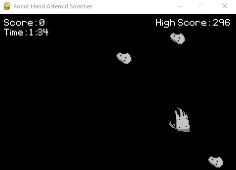

## Game Concept
You play as a robot hand deep in the darkness of space.
With only two minutes worth of power left your objective is to smash as many asteroids as you can.
Good luck!  

## List of Technologies Used
- [Python 3.9.7](https://www.python.org/downloads/release/python-397/ "Python 3.9.7")
- [Pygame 2.0.1](https://www.pygame.org/docs/ "Pygame Documentation")
- [Visual Studio Code](https://code.visualstudio.com/ "VS Code")
- Microsoft Paint
- [BeepBox](beepbox.co/ "BeepBox")

## Motivation Behind the Game
I was inspired by the games made by YouTuber [DaFluffyPotato](https://www.youtube.com/c/DaFluffyPotato "DaFluffyPotato's YouTube Channel")
using [Pygame](https://www.pygame.org/docs/) and started going through the [Pygame tutorials](https://www.pygame.org/docs/#tutorials "Pygame Documentation Tutorials")
available in the documentation. After completing the [Line By Line Chimp](https://www.pygame.org/docs/tut/ChimpLineByLine.html "Line By Line Chimp Tutorial") I got a grasp
of the basics like blitting an image onto the screen and detecting mouse movement and wanted to make a game which would enable me to practice these concepts and expand on them.
Thus, [Robot Hand Asteroid Smasher](https://github.com/tonypham04/Robot-Hand-Asteroid-Smasher "RHAS Repo") was born.

## References